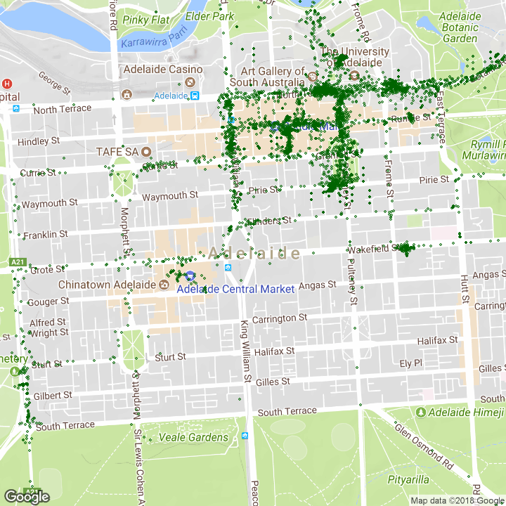

R maps repo
---------
Welcome to my R maps repository!

Here, you will find a collection of my maps created using R, samples of my personal mapmaking I enjoy doing as a hobby in my spare time.

In this repository, you'll find a variety of my R map renditions, from simple depiction of locations to more complex plots and interactive maps. I am passionate about exploring and creating in the world of 3D graphics and animation, and R has become one of my favorite tools for spatial data visualization. Whether I'm filtering geographic data, designing visualization styles, or experimenting with new frameworks, I always strive to learn and improve my skills with each project.

If you appreciate my work and would like to support me or collaborate on a project, please feel free to reach out to me via email at asheshwor at gmail. I am always open to new ideas and partnerships in the world of map-making, and any contributions or feedback are greatly appreciated.

If you're interested in seeing more of my work, I invite you to visit my website at https://www.app.shrestha.au. There, you can find a wider variety of my personal and professional works, as well as my latest updates and projects.

Thank you for visiting my repository, and I hope you enjoy my R maps creations!

Simple country map with point data added
----------
In this example, point data is mapped onto a country map.

https://github.com/asheshwor/R-maps/blob/master/01_simple-map.R

Great circle map
----------
Points across the globe are connected using great circle arcs in this example. An excellent way to visualize global inter-connections. In the first example, tourist arrival data for Nepal is visualized with colours representing the number of arrivales. The arrival figures have been extracted from pdf file at http://www.tourism.gov.np/uploaded/TourrismStat2012.pdf with a few edits on the name of countires to match the ones on the map.

https://github.com/asheshwor/R-maps/blob/master/02_great-circle-map.R

Another example of great circle map with international work permits data for Nepal. The figures have been extracted from pdf file at www.dofe.gov.np (in Nepali language) with minor edits on the name of countries.

Dynamic heatmap using leaflet and leafletheat plugin
----------
See example at http://asheshwor.com.np/host/heatmap.html

Interactive maps using Cartographer package
----------
See example at http://asheshwor.com.np/host/workpermits2011.html

Code:

5. Interactive maps using Shiny - Leaflet integration
----------
Leaflet map in a Shiny app for visualizing Nepal earthquake data https://github.com/asheshwor/np-quake
See live example at: https://asheshwor.shinyapps.io/np-quake

6. ggmap square map plots
----------
Code example: https://github.com/asheshwor/R-maps/blob/master/05_ggmap_google_location.R

