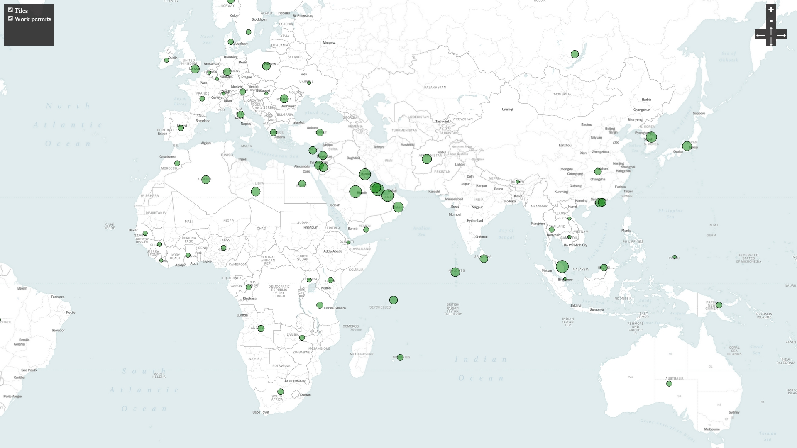
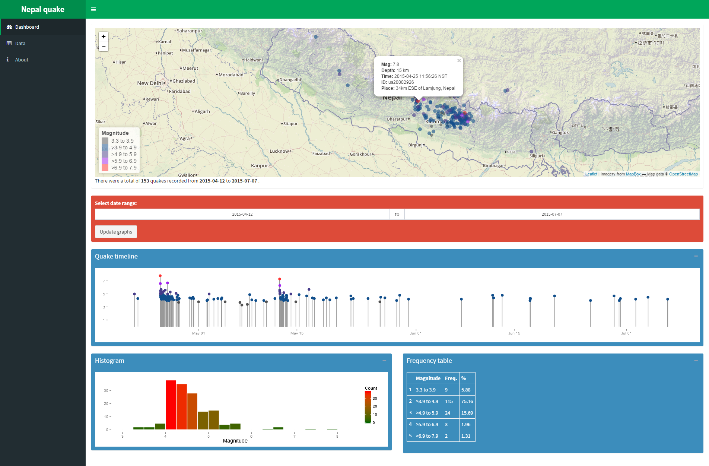

Mapping techniques in R
---------
This is a collection of R code for that I have been using for visualizing spatial data. Each of the different types of mapping techniques are briefly discussed below. As I explore more techniques, they will be added to the list.

Simple country map with point data added
----------
In this example, point data is mapped onto a country map.

https://github.com/asheshwor/R-maps/blob/master/01_simple-map.R

Great circle map
----------
Points across the globe are connected using great circle arcs in this example. An excellent way to visualize global inter-connections. In the first example, tourist arrival data for Nepal is visualized with colours representing the number of arrivales. The arrival figures have been extracted from pdf file at http://www.tourism.gov.np/uploaded/TourrismStat2012.pdf with a few edits on the name of countires to match the ones on the map.

https://github.com/asheshwor/R-maps/blob/master/02_great-circle-map.R

Another example of great circle map with international work permits data for Nepal. The figures have been extracted from pdf file at www.dofe.gov.np (in Nepali language) with minor edits on the name of countries.

Dynamic heatmap using leaflet and leafletheat plugin
----------
See example at http://asheshwor.com.np/host/heatmap.html

Interactive maps using Cartographer package
----------
See example at http://asheshwor.com.np/host/workpermits2011.html

Code: 

5. Interactive maps using Shiny - Leaflet integration
----------
Leaflet map in a Shiny app for visualizing Nepal earthquake data https://github.com/asheshwor/np-quake
See live example at: https://asheshwor.shinyapps.io/np-quake

6. ggmap square map plots
----------
